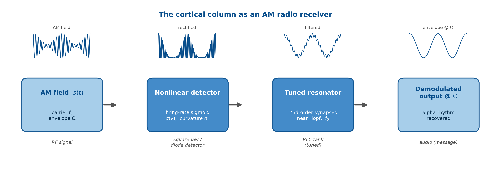
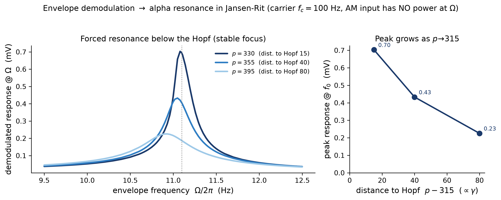

# TN0484 — A neural-mass mechanism for temporal-interference envelope demodulation

Sigmoid curvature + near-Hopf amplification as a **mesoscopic, network** mechanism
for temporal-interference (TI) stimulation. An amplitude-modulated (AM) field
carries no spectral power at its envelope frequency, so demodulation requires a
nonlinearity. We show that the population firing-rate **sigmoid** of a neural mass
is a square-law demodulator, and that a second-order-synapse network **near a Hopf
bifurcation** resonantly amplifies the recovered envelope. The ladder runs from the
heuristic single-column Jansen–Rit (JR) model, through the laminar **LaNMM** (two
bands), to the exact mean-field **NMM2** (derived rectifier), down to a spiking
**QIF** network, and out to a **tACS** corollary that shares the same amplifier.

> **Key message:** *wherever a fast-enough nonlinearity samples the carrier, the
> population sigmoid demodulates and the network amplifies* — the single-cell entry
> point supplies the carrier sampling, while the demodulation read-out and resonant
> gain are network properties.




## Repository layout

```
.
├── README.md                              # this file
├── TN0484_envelope_demodulation.tex       # the manuscript (\graphicspath{{figures/}})
├── TN0484_envelope_demodulation.pdf       # last good build (29 pp)
├── TN0484_envelope_demodulation.bbl       # committed so a single pdflatex works w/o bibtex
├── references.bib                         # BibTeX source for all references
├── requirements.txt                       # pinned Python deps (numpy/scipy/matplotlib + ...)
├── figures/                               # fig_*.pdf (used by LaTeX) + fig_*.png (preview)
├── code/                                  # all simulation/analysis code
│   ├── run_all.py                         # ONE-COMMAND reproduce of every figure
│   └── ...                                # generators + engines (see table below)
└── docs/
    ├── current_state.md                   # running changelog (newest on top — read first)
    ├── plan.md, HANDOFF.md, README_Code.md
    └── ...
```

## Setup

```bash
python3 -m venv .venv && source .venv/bin/activate
pip install -r requirements.txt          # numpy, scipy, matplotlib (+ deps)
```

## Build the paper

From the repo root (the `.tex` is at the root; `\graphicspath{{figures/}}`):

```bash
pdflatex TN0484_envelope_demodulation
bibtex   TN0484_envelope_demodulation
pdflatex TN0484_envelope_demodulation
pdflatex TN0484_envelope_demodulation
```

Last known good: **29 pp, 0 undefined refs, 0 citation warnings.** The `.bbl` is
committed, so a single `pdflatex` rebuilds the PDF when references are unchanged.

## Reproduce the figures

One command regenerates everything, in dependency order, into `figures/`:

```bash
cd code
python run_all.py                  # full reproduce -> ../figures/ (heavy; overwrites)
python run_all.py --figdir /tmp/f  # preview into a scratch dir (figures/ untouched)
python run_all.py --list           # print the figure->script map and exit
python run_all.py --only fig_jcurve,fig_khz   # rebuild a subset
```

Every generator honors the `TN_FIGDIR` env var (or `--figdir`) and defaults to
`../figures/`. Data producers write `.npz` into `code/`; six of these are committed
so the dependent figures can be rebuilt without re-running the (slow) sweeps.

### Figure → script table (verified)

24 figures are included by the manuscript. Status legend: **OK** = generator writes
to `figures/` and runs from committed inputs; **gap** = no working generator.

| figure | script | data dep. | scipy | status |
|---|---|---|---|---|
| fig_concept | `figures_v2.py` | analyses_v2.npz† | – | OK |
| fig_bifurcation_sigmoid | `figures_v2.py` | analyses_v2.npz† | – | OK |
| fig_resonance_map | `figures_v2.py` | analyses_v2.npz† | – | OK |
| fig_carrier_independence | `figures_v2.py` | analyses_v2.npz† | – | OK |
| fig_operating_point | `figures_v2.py` | analyses_v2.npz† | – | OK |
| fig_demodulation | `make_figures.py` | (inline) | – | OK |
| fig_verification | `make_figures.py` | (inline) | – | OK |
| fig_resonance | `rerun_resonance.py` (stable/cycle/plot) | (inline, long lock-in) | – | OK |
| fig_khz | `khz_analysis.py` | (inline) | yes | OK |
| fig_khz_direct | `khz_direct.py` (imports `timing_not_rate`) | (inline) | – | OK |
| fig_jcurve | `make_jfig.py` | jcurve_main.npz, jcurve_res.npz ‡ | (engine) | OK |
| fig_nmm2_map | `nmm2_ping.py` | (inline grid) | – | OK |
| fig_nmm2_resonance | `nmm2_ping.py` | (inline grid) | – | OK |
| fig_lanmm_map | `lanmm_resonance.py` | (inline grid) | – | OK |
| fig_lanmm_resonance | `lanmm_resonance.py` | (inline grid) | – | OK |
| fig_lanmm_arnold_p1 | `lanmm_arnold_tongues.py` | needs **lanmmv11** (external) | yes | needs ext. module |
| fig_lanmm_arnold_p2 | `lanmm_arnold_tongues.py` | needs **lanmmv11** (external) | yes | needs ext. module |
| fig_timing_not_rate | `timing_not_rate.py` | (inline) | – | OK |
| fig_qif_raster | `make_qif_figs.py` | qif_raster.npz ‡ | – | OK |
| fig_qif_timing | `make_qif_figs.py` | qif_raster.npz ‡ | – | OK |
| fig_tacs_jcurve | `tacs_jsweep.py` | (inline) | – | OK |
| fig_lanmm_setup | — | — | – | **gap**: hand-drawn schematic |
| fig_nmm2_jcurve | — (data: nmm2_jcurve.npz ‡) | — | – | **gap**: plotter missing |
| fig_entrainment | — (data: entrain*.npz, not committed) | — | – | **gap**: plotter + data missing |

† `analyses_v2.npz` is **not** committed — `run_all.py` regenerates it via `analyses_v2.py` first.
‡ committed `.npz` (figure rebuildable without re-running the sweep).

The three **gaps** are tracked in `docs/current_state.md`:
`fig_lanmm_setup` is intentionally hand-drawn; `fig_nmm2_jcurve` has its data committed
but its plotting script was never committed; `fig_entrainment` has neither.

### Engines & helpers (not figure generators)

- `jr_demod.py` — core JR engine (sigmoid + derivatives, vectorized RK4, AM field,
  lock-in, open-loop detector, Hopf helpers). Imported by the old JR pipeline.
- `jr_jsweep_engine.py` — J-curve engine; imported by `run_jcurve/run_res/make_jfig`.
- `nmm2_jcA.py` — NMM2 J-curve engine (imported by `nmm2_jcD.py`).
- `timing_not_rate.py`, `qif_raster.py` — data producers (also self-plot where noted).
- `test_jr_demod.py` — self-checks (derivatives, fixed point, square law, control).

## Verified

`test_jr_demod.py`: sigmoid derivatives match finite differences (and σ″(v₀)=0);
the field-free fixed point is an equilibrium; square-law slope ≈ 1.99 (theory 2);
linearizing the field-receiving sigmoid collapses the response ≈712×. (Needs scipy.)

## Notes on artifacts

Currently committed: the rendered `.pdf` (~5 MB, re-committed each build), the `.bbl`
(so collaborators need not run bibtex), and six `.npz` data files. LaTeX build
junk (`.aux/.log/.out/.toc/.blg`), `__pycache__`, and `.venv/` are git-ignored.
Whether to keep committing the `.pdf` and `.npz` is an open policy question (see
`readme_moving_notes.md`).
